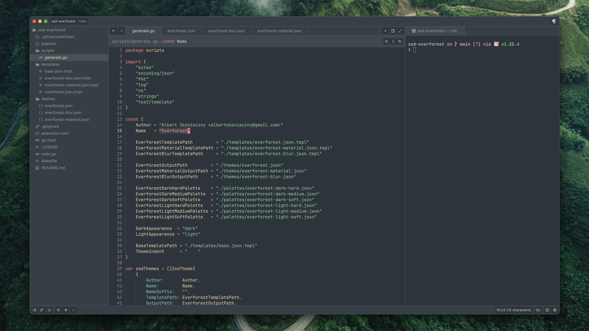
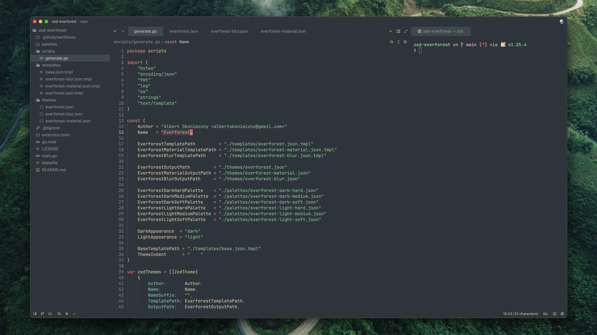
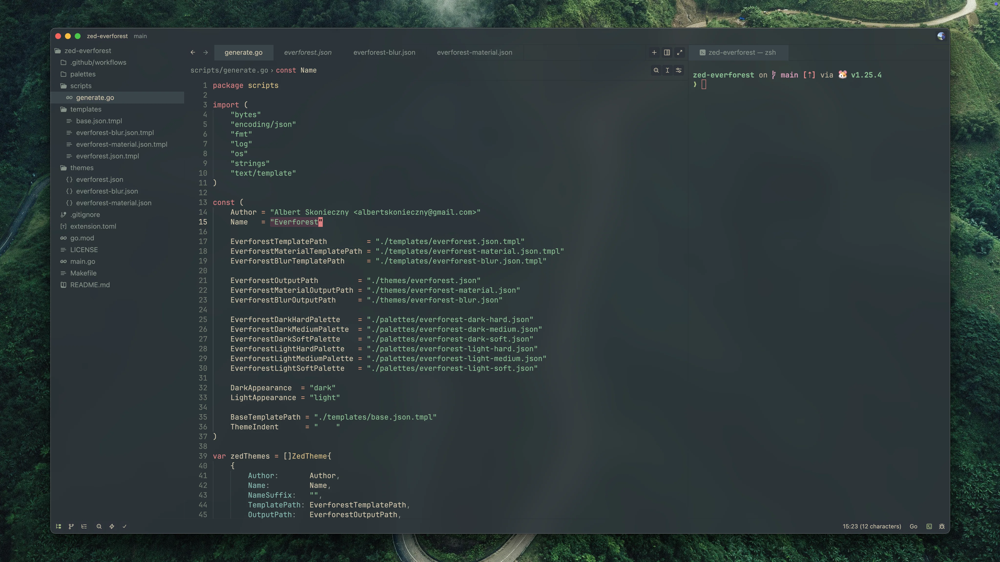
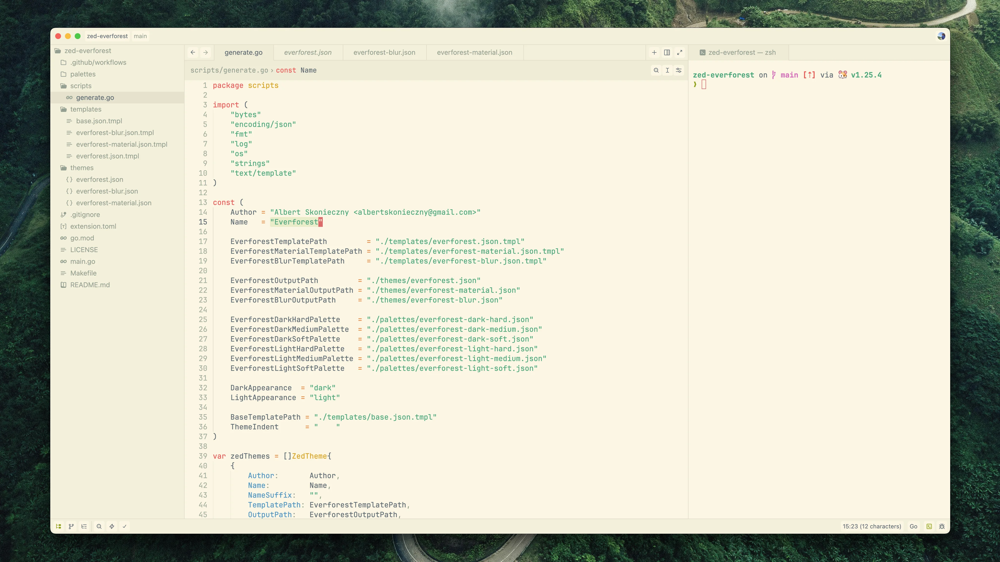
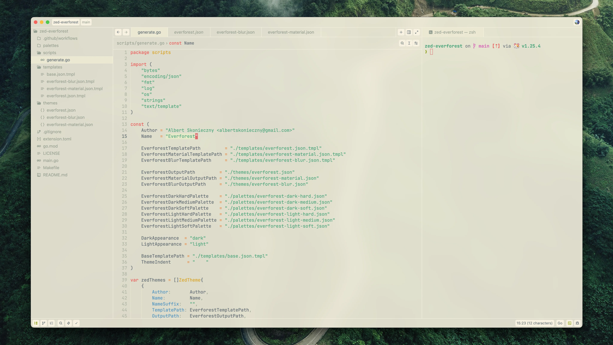

# 🌲 Everforest for Zed

[Everforest](https://github.com/sainnhe/everforest) color scheme for Zed.
Theme comes in `regular`, `material`, and `blur` variants.

## 🖼️ Preview

<table>
  <thead>
    <tr>
      <th>Theme</th>
      <th width="33%"><code>regular</code></th>
      <th width="33%"><code>material</code></th>
      <th width="33%"><code>blur</code></th>
    </tr>
  </thead>
  <tbody>
    <tr>
      <td>Dark Medium</td>
      <td></td>
      <td></td>
      <td></td>
    </tr>
    <tr>
      <td>Light Medium</td>
      <td></td>
      <td></td>
      <td></td>
    </tr>
  </tbody>
</table>

_Wallpaper shown in the background: [aerial photography of roadway](https://unsplash.com/photos/aerial-photography-of-roadway-Wn4ulyzVoD4)._

## 🛠️ Development

- Entrypoint of the theme generator is `./main.go`.
- Use `make generate` to generate themes using `Generate()` from `./scripts/generate`.
- Use `make copygen` to generate the themes and copy them into `~/.config/zed/themes`.
- Generator takes `./palettes`, and `./templates` to generate `./themes`
- Focus on `./templates` in your contribution.
